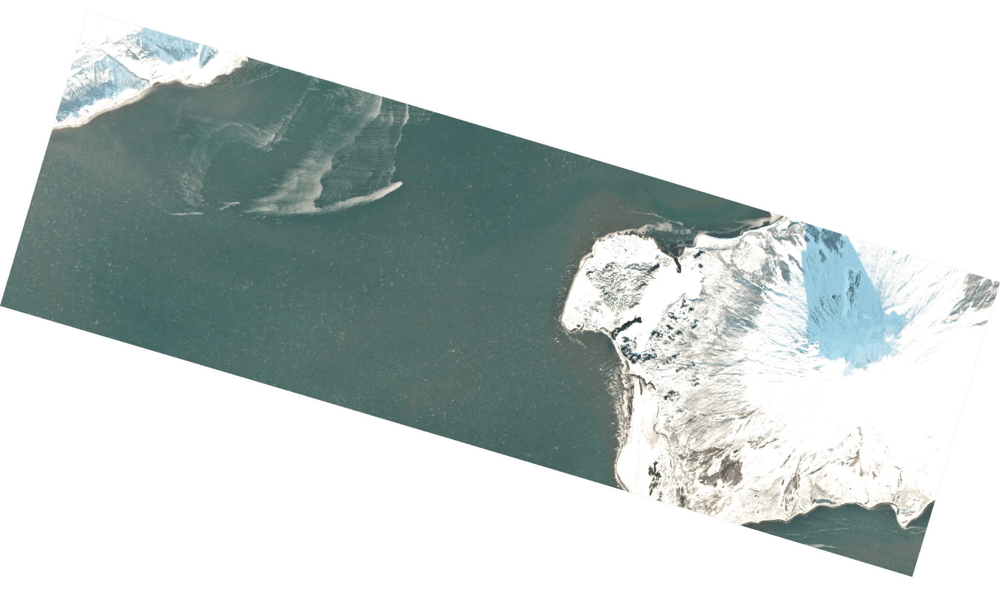

# planet_thumbs

A tool for downloading Planet Labs imagery thumbnails, like the one below.



<p align="center">
  <sup><i>Augustine Volcano on 10 February 2020. Imagery © 2020 Planet Labs.</i></sup>
</p>

## Quickstart

**NOTE:** This tool requires a valid Planet Labs API key. Set the environment
variable `PL_API_KEY` to your key's value prior to running the script.

1. Prepare
   ```
   conda create -n planet_thumbs -c conda-forge planet
   conda activate planet_thumbs
   ```

2. Obtain
   ```
   git clone https://github.com/liamtoney/planet_thumbs.git
   cd planet_thumbs
   ```

3. Run
   ```
   python planet_thumbs.py <alaskan_volcano_name>
   ```
