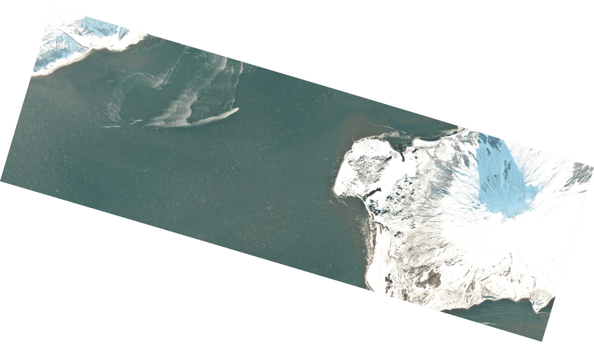

# planet_thumbs

A tool for downloading Planet Labs imagery thumbnails, like the one below, for
Alaskan volcanoes. (Also provides a shell script for downloading full-resolution
images.)



<p align="center">
  <sup><i>Augustine Volcano on 10 February 2020. Imagery © 2020 Planet Labs.</i></sup>
</p>

## Quickstart

**NOTE:** Both scripts require a valid Planet Labs API key. Set the environment
variable `PL_API_KEY` to your key's value prior to running either script. To
sign up for the Planet Labs Education and Research Program, go
[here](https://www.planet.com/markets/education-and-research/).

1. Prepare
   ```
   conda create -n planet_thumbs -c conda-forge jq planet
   conda activate planet_thumbs
   ```

2. Obtain
   ```
   git clone https://github.com/liamtoney/planet_thumbs.git
   cd planet_thumbs
   ```

3. Run
   ```
   python planet_thumbs.py <alaskan_volcano_name>
   ```
   or
   ```
   ./download_planet_asset <item_id> <item_type> <asset_type>
   ```

## Examples

1. To grab the most recent thumbnails for Korovin Volcano, run
   ```
   python planet_thumbs.py korovin
   ```
   which produces the following thumbnails (when run on 17 March 2020).
   ```
   korovin_20200217_215658_99_106c_PSScene3Band.png
   korovin_20200203_220225_16_106a_PSScene3Band.png
   korovin_20200129_215846_15_106e_PSScene3Band.png
   korovin_20200116_221649_101e_PSScene3Band.png
   korovin_20191220_220344_71_1067_PSScene3Band.png
   ```
   Output files have the format
   ```
   <volcano_name>_<item_id>_<item_type>.png
   ```

2. To grab the full-resolution visual image corresponding to the first thumbnail
   listed above, run
   ```
   ./download_planet_asset 20200217_215658_99_106c PSScene3Band visual
   ```
   which downloads the full-resolution product as
   ```
   20200217_215658_99_106c_PSScene3Band_visual.tif
   ```

## Notes

1. The first time `download_planet_asset` is run for a given item, the item
   is "activated" (queued for downloading). Repeated calls to the script will
   print `activating` until the item is queued; then a call to the script will
   download the file.

2. The downloading script is only designed to work with `<asset_type>` values
   of `analytic` (usually requires processing to be viewable, contains all image
   data) and `visual` (immediately openable and viewable, less information).
